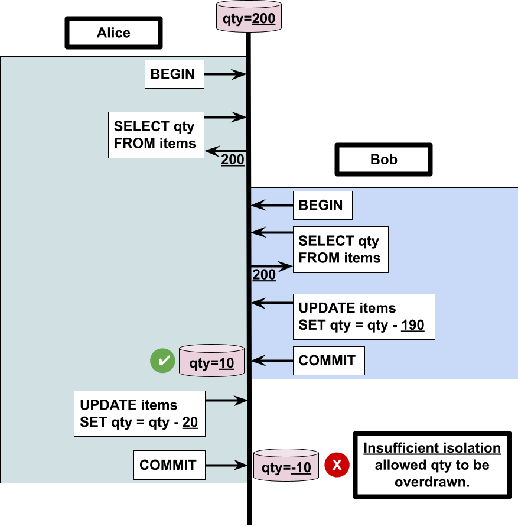
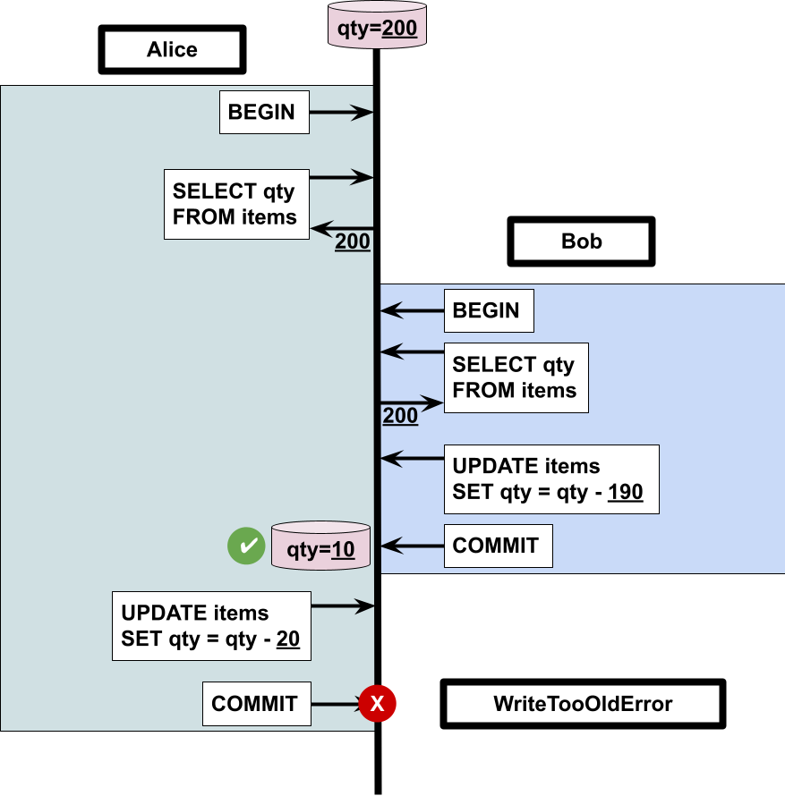

== CockroachDB Transaction Best Practices

This repository contains a sample application that illustrates some best practices regarding transaction handling with CockroachDB.

The project included uses Spring Boot + Spring Data JPA.

=== Database Schema + Sample Data

[source,sql]
----
-- drop tables
DROP TABLE IF EXISTS items;

-- re-create tables
CREATE TABLE items (item_id UUID PRIMARY KEY DEFAULT gen_random_uuid (),
                    name STRING,
                    description STRING,
                    price DECIMAL NOT NULL,
                    quantity INT DEFAULT 0);

INSERT INTO items (name, description, quantity, price) VALUES ('foo', 'fang', 200, 0.0);
----

=== JPA Structure

The following Java class shows the JPA structure used in the app:

[source,java]
----
@Entity
@Table(name = "items")
class Item {

	@Id
	@GeneratedValue(strategy = GenerationType.UUID) //
	private UUID itemId;

	private String name;

	private String description;

	private int quantity;

	private double price;

    ...
}
----

To see the rest of the project, feel free to clone this repository and open it up inside your favorite IDE.

=== Read Committed Transaction

The following diagram illustrates a simple scenario that involves *read committed* transactions, and what can happen when you have competing transactions.

=== Serializable Transaction

The following diagram illustrates a simple scenario that involves *serializable* transactions, and how competing transactions can translate into an exception, which can be handled.

